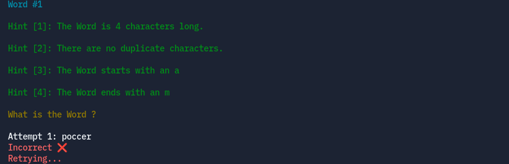
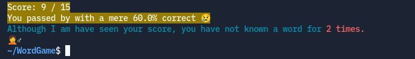

<h1 align="center">Knowliz</h1>

<p align="center"></p>

A Word Guessing Game, 
Where you have to Guess a Word given 4 Hints. 
This program is a shell program that can be ran
from your terminal.

## Features

<h4>The program works by
asking you to type out a word
given 4 Hints, and then pressing the enter button to see
if your attempt was correct or not.</h3>


<h4>If your attempt 
was not correct, you will have to retry
guessing the same word with another attempt.</h4>



<h4>Otherwise, if the attempt
was correct, it will add that word to the words that you've guessed correctly.
You will then be able to move on to the next random word!</h4>


<h4>If you're struggling too much with a word
and can't just bother to try guessing until you're right, you can simply
type in the following:</h4>

```
show_awnser
```
<h4>If you type in the text as shown above correctly, it will show you the awnser.
The awnsers which you choose to show are recorded as the amount of awnsers you couldn't guess.</h4>


<h4>Once you've completed the game and you want to see your results, you can simple type the following to the attempt:</h4>

```
finish_game
```

<h4>Like the above command, make sure to spell this exactly as it is with the underscores included respectivley.
When hitting enter, the command will show your results and end the game.</h4>



<h4>
	If you would like to close the program, simply hit the 
	close button at the top of the shell/terminal window.
	Alternativley, you could also quit the game without seeing 
	your results by pressing Ctrl-C. If you press Ctrl-C
	with your mouse active on the window, this will work and the
	game should give you a message like this:
</h4>


<h3>Those are all the features Knowliz has for now!</h3>

## Running the Game

<h4>An executable version of this program will be ready in the future.
For now, you can run the program by doing the following things:</h4>

1. Make sure that you have the following installed:
   1. The Python programming language
with the Pip package manager
	2. Git

3. Clone this Repository by typing the following in
   your system's terminal or shell:
	1. Go to a folder in your filesystem where you want
      to clone Knowliz:

      `cd <destination>`
   
    2. Clone the repository:

       `git clone https://github.com/TheEliteCoder1/Knowliz.git`

	3. After cloning Knowliz, you should see a folder created named Knowliz in the destination you were in.
      To run the program we will need to go inside that folder:

	  `cd Knowliz`

	4. Now, every time you wanna run this program, you can just open up
	   this folder in you filesystem explorer and click on the file named `Knowliz.py`,
		or open up this folder in your terminal and run `Knowliz.py` with this command:

		1. Windows Command:
      
		`python Knowliz.py`

		2. Linux/MacOS Command:

		`python3 Knowliz.py`

